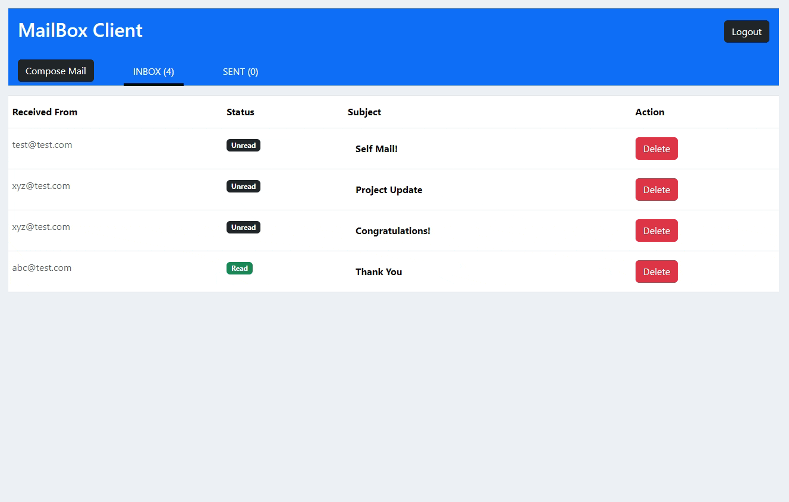

# 📬 MailBox Client



Welcome to MailBox Client, a robust email application developed with React. Users can sign up, log in, and seamlessly send and receive emails. This app utilizes Firebase for user authentication, email storage, and Redux for state management. A visually appealing badge status indicates whether inbox messages are read or unread, with status stored in Firebase Realtime Database.

## Features

- **User Authentication:**
  - Users can sign up and log in using their email and password. Demo credentials:
    - 📧 Email: test@test.com
    - 🔒 Password: 123456

- **Email Functionality:**
  - Send and receive emails effortlessly within the application.

- **Firebase Integration:**
  - Firebase is employed for secure user authentication and email storage.

- **Redux State Management:**
  - Utilizes Redux for efficient state management, enhancing application scalability.

- **Badge Status:**
  - Displays a cool badge status indicating whether inbox messages are read or unread.

## Getting Started

To run the project locally, follow these steps:

1. Clone the repository:
   ```bash
   git clone https://github.com/rishii-27/mailbox-client.git

2. **Navigate to the project directory:**

    ```bash
    cd mailbox-client
    ```

3. **Install dependencies:**

    ```bash
    npm install
    ```

4. **Start the development server:**

    ```bash
    npm start
    ```

5. **Open your browser and visit** [http://localhost:3000](http://localhost:3000) **to view the app.**
